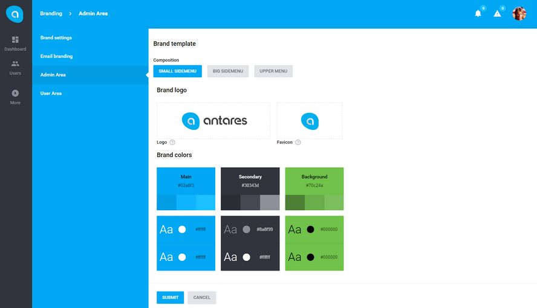

# Antares Branding Module

Antares Branding Module gives a possibility of dividing the application into brands. By default, one main brand which is simultaneously the default brand is set during the system installation. Brands' functionalities provides the possibility of defining own color settings for the whole application, default composition of e-mail templates (header, style, footer), url, date and language settings. Dividing the application into areas is a superior function in relation to brands.

## Documentation

Antares Branding Module documentation is not ready yet.

Full Antares documentation can be found at [docs.antaresproject.io/php-framework](http://www.docs.antaresproject.io/php-framework).

## Changelog

Antares Branding Module changelog can be found in release notes [docs.antaresproject.io/php-framework/getting-started/changelog#branding](http://www.docs.antaresproject.io/php-framework/getting-started/changelog#branding).

You can find full Antares changelog in Antares Documentation [docs.antaresproject.io/php-framework/getting-started/changelog](http://www.docs.antaresproject.io/php-framework/getting-started/changelog).

## Issues

The issue list of this repo is **exclusively** for bug reports and feature requests.

Please follow [Issue Reporting Guide](http://www.docs.antaresproject.io/php-framework/getting-started/issues-reporting-guide) before opening an issue. Issues not following the guide will be closed without further investigation.

## Contribution

Please follow [Contribution Guide](http://www.docs.antaresproject.io/php-framework/getting-started/contribution-guide) before making a pull request.

## Community

* Twitter: @antaresproject
* Forum: (coming soon)
* Blog: (coming soon)
* Email: contact (at) antaresproject.io

## License

This software is released under the BSD 3-Clause License.

© 2017 INBS.Software.
